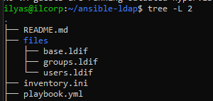
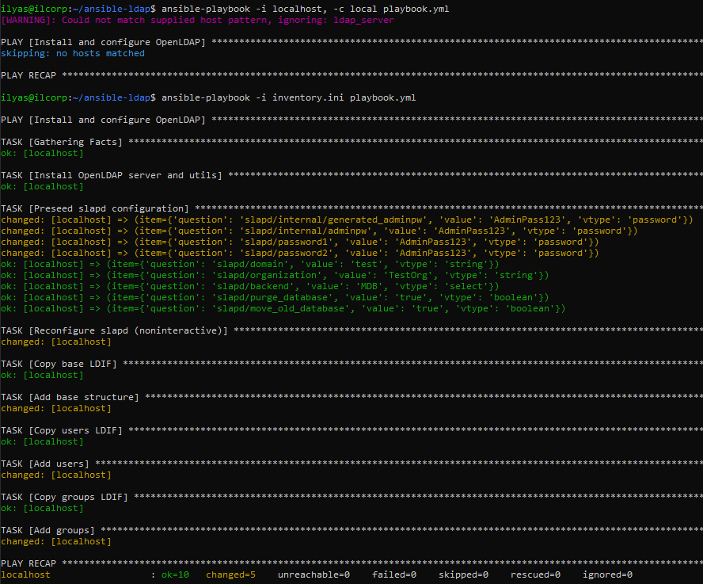

# OpenLDAP Ansible Setup

## Описание

Этот Ansible playbook предназначен для установки и базовой настройки OpenLDAP на сервере (локально или удалённо).

Он выполняет следующие шаги:

1. Устанавливает пакеты `slapd` и `ldap-utils`.
2. Настраивает пароль администратора (`cn=admin,dc=test`).
3. Создаёт домен `test` и организацию `TestOrg`.
4. Создаёт базовую структуру LDAP: организационные единицы `users` и `groups`.
5. Добавляет двух пользователей (`user1`, `user2`) с паролями.
6. Создаёт две группы (`group1`, `group2`) и добавляет в них пользователей.

> ⚠️ Для корректной работы предварительно нужно установить `debconf-utils`, иначе предварительное заполнение пароля может не сработать.

## Структура проекта

```
ansible-ldap/
├── inventory.ini         # файл инвентаря (может быть localhost)
├── playbook.yml          # основной Ansible playbook
├── files/
│   ├── base.ldif         # базовая структура LDAP (OU users и groups)
│   ├── users.ldif        # создание пользователей
│   └── groups.ldif       # создание групп
└── README.md             # данный файл
```



## Настройка и запуск

### 1. Установка зависимостей

```bash
sudo apt update
sudo apt install ansible debconf-utils -y
```

### 2. Конфигурация инвентаря

Если вы запускаете playbook **на локальной машине**, используйте `localhost`:

`inventory.ini`:

```ini
[ldap_server]
localhost ansible_connection=local
```

Если сервер LDAP находится на другом хосте:

```ini
[ldap_server]
10.1.8.154 ansible_user=ubuntu ansible_ssh_pass=YOUR_PASSWORD
```

### 3. Запуск playbook

```bash
ansible-playbook -i inventory.ini playbook.yml
```

> Альтернатива для локального запуска без inventory:

```bash
ansible-playbook -i localhost, -c local playbook.yml
```



## Проверка работы LDAP

1. Проверка пользователей и групп:

```bash
ldapsearch -x -D "cn=admin,dc=test" -w AdminPass123 -b "dc=test"
```


2. Должны появиться:

* OU: `users` и `groups`
* Пользователи: `user1`, `user2`
* Группы: `group1`, `group2`

## Полезные команды для отладки

* Проверка статуса slapd:

```bash
sudo systemctl status slapd
```

* Сброс пароля администратора (если нужно):

```bash
sudo slappasswd -s AdminPass123
ldapmodify -Y EXTERNAL -H ldapi:/// -f update_admin.ldif
```

* Проверка структуры LDAP:

```bash
ldapsearch -x -LLL -b "dc=test"
```

## Скриншоты результата

После успешного запуска плейбука рекомендуется выполнить команду:

```bash
ldapsearch -x -D "cn=admin,dc=test" -w AdminPass123 -b "dc=test"
```

и сделать скриншот вывода, где видны OU, пользователи и группы.


